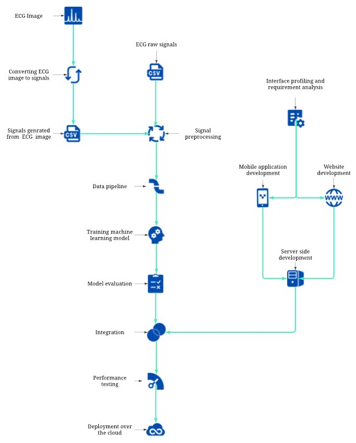

# CardioGraph Pro

CardioGraph Pro is a comprehensive system for early detection and management of heart disease. It integrates advanced machine learning, ECG signal analysis, demographic data, image processing, and user-friendly interfaces for accurate predictions and personalized guidance.

## Table of Contents

- [Abstract](#abstract)
- [Project Motivation](#project-motivation)
- [Features](#features)
- [Technologies](#technologies)
- [Installation and Setup](#installation-and-setup)
- [Usage Instructions](#usage-instructions)
- [Architecture](#architecture)
- [Data Collection and Preprocessing](#data-collection-and-preprocessing)
- [Model Development and Training](#model-development-and-training)
- [Deployment](#deployment)
- [Results and Evaluation](#results-and-evaluation)
- [Contributers](#contributers)
- [More Details](#more-details)
- [Let's Connect](#contact)

## Abstract 

CardioGraph Pro offers innovative solutions to address the challenges of timely heart disease diagnosis. It combines ECG signal analysis, demographic data integration, and image-based ECG report processing to enhance prediction accuracy. The project's user-centric design, including a web interface, mobile app, and medical chatbot, prioritizes accessibility and promotes disease management for patients.

## Project Motivation 

CardioGraph Pro is driven by the need for early and reliable detection of heart disease, a leading cause of mortality worldwide. By integrating multiple data sources and leveraging machine learning, the project aims to:
- Improve Prediction Accuracy: Achieve superior results compared to traditional methods.
- Enhance Accessibility: Provide accessible heart health assessment tools.
- Promote Early Detection: Encourage timely interventions for better outcomes.

## Features 

- Robust Machine Learning Models: Predicts heart disease using advanced techniques and multiple data sources, ensuring increased precision.
- ECG Signal and Image-Based Report Analysis: Accommodates both conventional ECG signals and image-based ECG reports for broader utility.
- Demographic Data Integration: Incorporates age, gender, medical history, etc., into the prediction model for personalized risk assessment.
- Cloud-Based Deployment: Scalable and accessible model deployment for widespread use.
- Web Interface: Enables doctors and patients to upload ECG data, access predictions, prescriptions, and diet plans.
- Mobile Application: Facilitates image-based ECG report uploads for convenient predictions on the go.
- Medical Chatbot (Web): Interprets results, answers questions, and offers basic medical guidance tailored to cardiac health.

## Technologies 

### Core Technologies:

- Python: Main programming language
- TensorFlow/Keras: Deep learning model development
- scikit-learn: Additional machine learning tools
- OpenCV: Image processing
- NumPy/Pandas: Data manipulation

### Web Development:

- HTML5/CSS3/JavaScript: Web structure, styling, interactivity
- Bootstrap: Responsive design
- Flask/Django: Python web backend
- React: Modern frontend development

### Mobile Development:

- React Native: Cross-platform mobile app development

### Databases:

- MS SQL Server: Model data storage
- MongoDB: User data and medical history

### Integrated Development Environments

- Google Collab: Cloud-based notebooks for model development.
- Visual Studio Code: Lightweight IDE for app and web development.
- Jupyter Notebook: Interactive environment for data analysis.
- Anaconda: Python distribution platform for virtual environments.

## Installation and Setup 

1. **Dependencies**: List all required Python libraries, frameworks, and any external tools. Use a requirements.txt file to manage dependencies with versions if possible.
2. **Environment Setup**: Guide users on setting up a virtual environment (recommended).
3. **Installation Sequence**: Provide step-by-step instructions on installing the project and its dependencies.
4. **Database Setup**: If applicable, explain database configuration and connection process.

## Usage Instructions 

- **Web Interface**:
  - Login/Signup: Describe user authentication processes.
  - Uploading ECG Data Support for different file formats (signals, image reports).
  - Viewing Predictions: How the prediction results, prescriptions, and diet plans are presented.
  - Chatbot Interaction: Explain how to access the chatbot and the types of queries it can answer.
- **Mobile App**:
  - Image Upload: File format support and upload process.
  - Prediction Display: How the mobile app shows the results.
- **Command-line Tools** (if applicable): Describe relevant commands, their arguments, and expected outputs.

## Architecture 

## Data Collection and Preprocessing 

- **Data Sources**:
  - ECG Data: Specify where you'll retrieve ECG signals (e.g., PhysioNet WFDB database, other public datasets, internal clinical data).
  - Demographic Data: Explain how this data is collected, formatted, and stored.
- **Preprocessing Techniques**:
  - Noise Removal: Detail the filtering algorithms employed.
  - Signal Segmentation: Methods used to divide ECG signals into individual heartbeats.
  - Image Processing: Describe any OCR or other techniques used to extract data from ECG image reports.
  - Feature Extraction: Important features derived from the data for model training.

## Model Development and Training 

- **Model Architecture**:
  - Type of Models: (e.g., convolutional neural network, recurrent neural network, decision trees, etc.).
  - Rationale: Briefly justify the choice of model architecture.
- **Training Process**:
  - Dataset Split: Percentages used for training, validation, and testing.
  - Loss Function: The metric the model optimizes during training.
  - Hyperparameters: List important hyperparameters and describe any tuning strategies.
- **Performance Evaluation**:
  - Metrics: (e.g., accuracy, precision, recall, F1-score, AUC-ROC).
  - Validation Methods: (Cross-validation, holdout set).

## Deployment 

- **Cloud Platform**: (e.g., AWS, Microsoft Azure, Google Cloud Platform)
- **Containerization**: Use of tools like Docker for packaging the application.
- **API Development**: (If applicable) Describe endpoints for the web/mobile applications to interact with.
- **Scaling Considerations**: Potential strategies to handle increased load.

## Results and Evaluation 

- **Quantitative Results**: Share performance metrics achieved on the test set.
- **Benchmarks**: Compare against other published results or baselines.
- **Discussion**: Analyze the significance of the results and potential limitations.

## Contributing 
This project was developed by [Asad Ali](https://github.com/asadali27232) in participation with [Muhammad Haroom Shahzad](https://github.com/HaroonMalik771) and [Asad ur Rehman](https://github.com/Asad-Rehman22). A project submitted in partial fulfilment of BS Computer Science degree at [COMSATS University Lahore](https://lahore.comsats.edu.pk/default.aspx).

## More Details 
For more details, please see the [documentation](https://github.com/asadali27232/FYP/tree/main/documentation) folder.

## Let's Connect 

